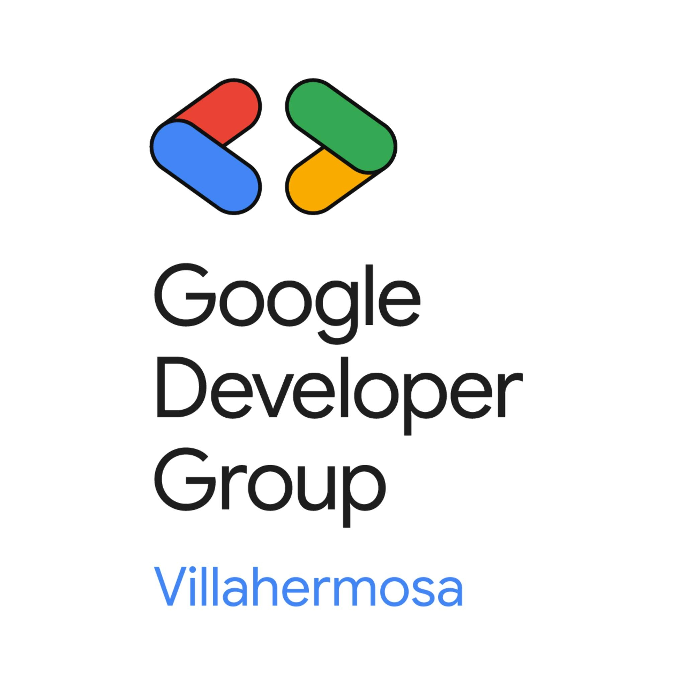
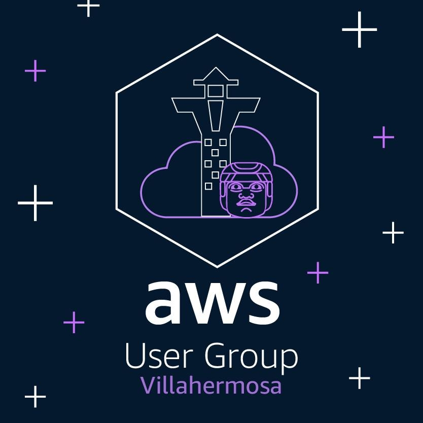
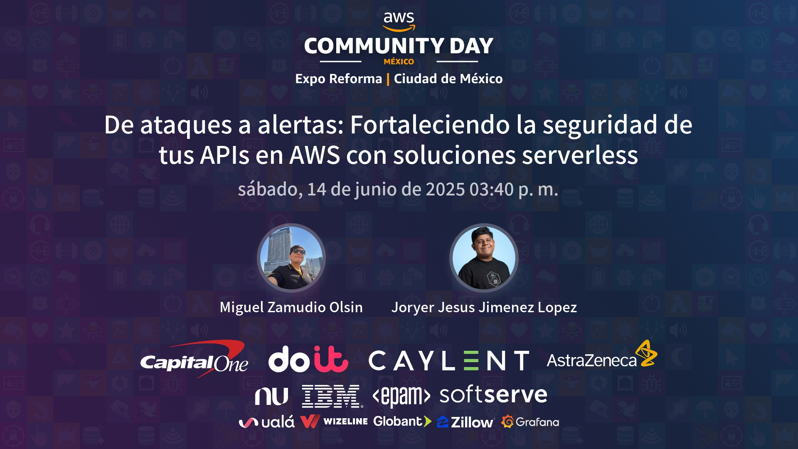
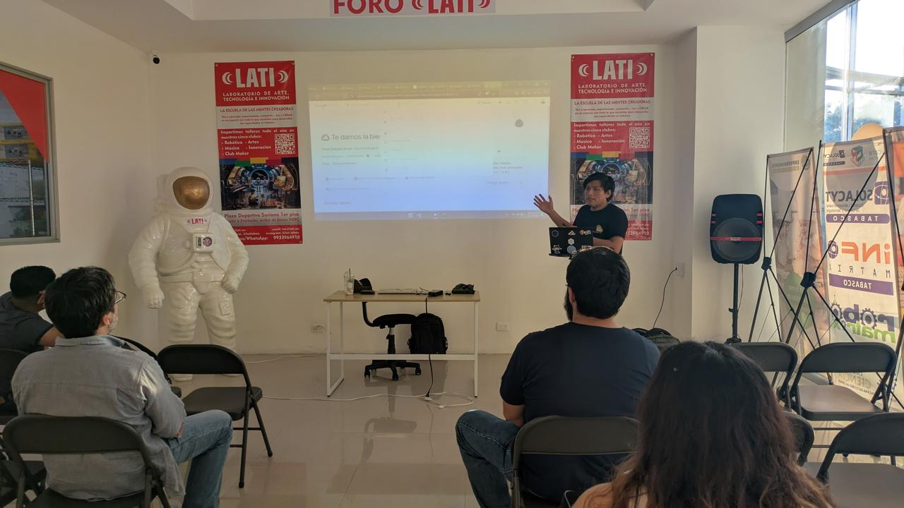
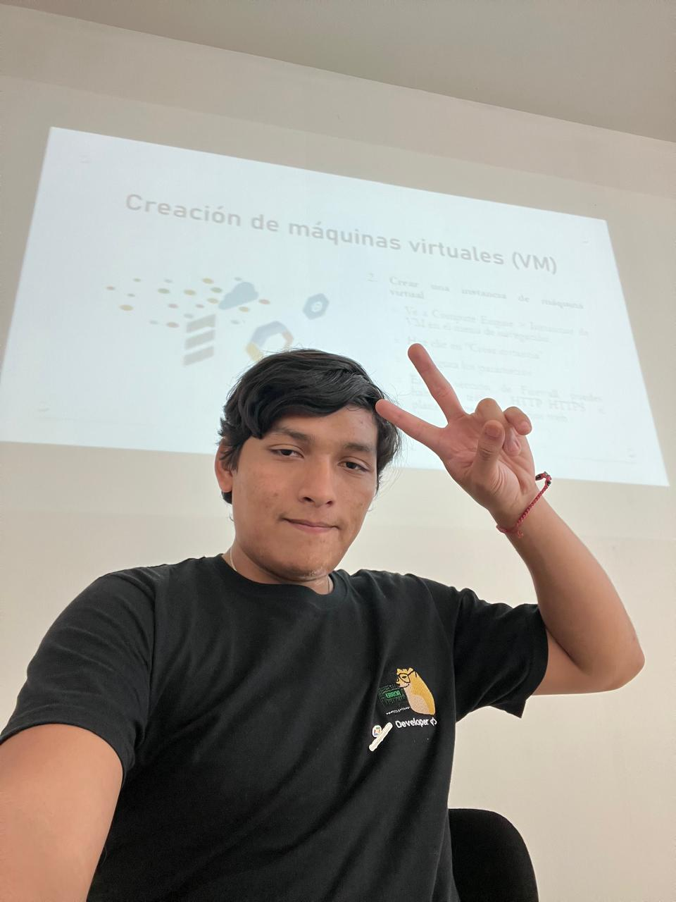

<h1 align="center">Hola Mundo 🧠🤖, soy Miguel Zamudio</h1>
<h3 align="center">💻 Desarrollo de Software | 🧪 Programador Backend | 🛡️ Ciberseguridad</h3>

  

  

---

### 🧠 Sobre mí

> Desarrollador de software y especialista en ciberseguridad con experiencia como freelancer y en empresa.  
> Capacidad innata para aprender rápidamente cualquier lenguaje de programación.  
> Trabajo bajo presión con enfoque colaborativo y empático hacia todas las personas.  

---

### 🚀 Tecnologías y Herramientas

  
  
  
  
  
  
  
  
  
  
  
  

---

### 📌 Habilidades Clave

- 🧩 **Web | Software | Bash | Python | Ciberseguridad**
- 🌱 Actualmente aprendiendo **Hacking Ético**
- 🧠 Capacidad de **autoaprendizaje veloz**
- 🤝 Trabajo **colaborativo y empático**
- 🗽 Trabajo en **empresa de ciberseguridad** y como **freelancer**

---

### 🌐 Encuéntrame

  
  
  
  
  

---

### 📊 Estadísticas GitHub

  
  

---

### 🧩 Comunidades

  
  &nbsp;&nbsp;&nbsp;&nbsp;
  
  &nbsp;&nbsp;&nbsp;&nbsp;
  

<b>Google Developer Group Villahermosa &nbsp; | &nbsp; AWS Villahermosa &nbsp; | &nbsp; GitHub Community </b>

---

### 🎤 &nbsp; Charlas

---

<!-- Charla 1 -->
  
**De ataques a alertas: Fortaleciendo la seguridad de tus APIs en AWS con soluciones serverless**  

En esta sesión intermedia comparti cómo, desde la perspectiva de un desarrollador con enfoque en ciberseguridad, se pueden proteger APIs utilizando servicios serverless nativos de AWS. Mostraremos cómo:

Detectar patrones sospechosos con AWS WAF y CloudWatch.

Automatizar respuestas con AWS Lambda ante eventos maliciosos.

Integrar estas herramientas en un flujo realista de DevSecOps. Usaremos ejemplos en Node.js con buenas prácticas de seguridad y arquitectura resiliente. Una charla ideal para quienes quieren proteger sus APIs sin complicarse con servidores.

📅 Fecha: _[14 de Junio del 2025]_  
📍 Lugar: _[Expo reforma CDMX]_

---

<!-- Charla 2 -->

  
**Más Allá del Ping: Nmap, Phishing y Scripts en eI Arte del Hacking Etico**  

En esta charla exploramos el fascinante mundo del hacking ético desde una perspectiva práctica. Iremos más allá del tradicional "ping" para adentrarnos en herramientas clave como Nmap para el reconocimiento de redes, técnicas de phishing usadas en pruebas de ingeniería social y la creación de scripts personalizados para automatizar tareas de análisis y explotación controlada.
A lo largo de la sesión, se demostrará cómo estas técnicas pueden ser aplicadas con fines defensivos, fortaleciendo la ciberseguridad de sistemas reales bajo un enfoque ético y profesional.

📅 Fecha: _[Sabado 22 De Febrero 2025]_  
📍 Lugar: _[Casa Universitaria Cacao y Chocolate]_

---

<!-- Charla 3 -->

**De Cero a la Nube: Desplegando tu Primera Máquina Virtual en GCP**  

En esta charla enseñe a dar  primeros pasos en la nube de Google (GCP) creando y desplegando tu propia máquina virtual desde cero. Exploraremos los conceptos básicos de la computación en la nube, la consola de GCP, el servicio Compute Engine y cómo lanzar una VM de forma segura y eficiente.
Ideal para quienes quieren iniciarse en la nube con un enfoque práctico, entendiendo cómo funciona la infraestructura que impulsa miles de servicios modernos.  

📅 Fecha: _[sábado, 23 de noviembre de 2024]_  
📍 Lugar: _[LATI - Laboratorio de Arte, Tecnología e Innovación]_

